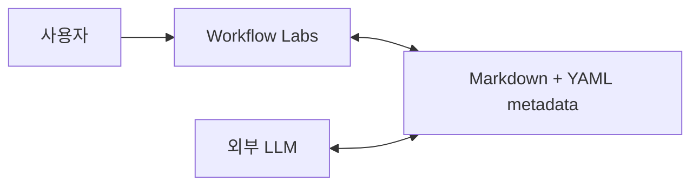
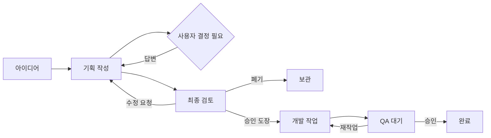

# Workflow Labs 제품·기술 기준

작성일: 2026-07-30

## 제품 정의

Workflow Labs는 프로젝트 디렉터리 안의 Markdown 문서를 아이디어, 기획, 승인, 개발 작업, QA 흐름으로 보여주는 로컬 우선 데스크톱 클라이언트다.

앱은 LLM을 실행하거나 제어하지 않는다. Codex, Claude Code 등 외부 LLM이 프로젝트의 Markdown을 읽고 쓰며, 앱은 파일과 메타데이터를 생성·관찰·시각화한다.



## 책임 경계

| 주체 | 책임 |
|---|---|
| 사용자 | 아이디어 입력, 중간 결정, 기획 승인·수정 요청·폐기, QA 승인 |
| 앱 | 프로젝트/워크플로우 생성, 상태 UI, 사용자 결정 기록, 파일 감시, 앱 업데이트, 문서 마이그레이션 |
| 외부 LLM | 아이디어 구체화, 기획서·작업·결과 보고서 작성, 작업 상태 메타데이터 갱신 |

앱과 LLM이 같은 본문을 동시에 다시 쓰지 않도록 LLM 생성 문서, 사용자 결정 문서, 앱 소유 상태 파일을 분리한다.

## 프로젝트 구조

```text
selected-project/
└── .workflow/
    ├── .gitignore
    ├── project.yml
    ├── .runtime/
    │   ├── leases/
    │   └── migrations/
    └── onboarding-redesign--wf-a7c4/
        ├── workflow.yml
        ├── README.md
        ├── ideas/
        ├── specs/
        ├── decisions/
        ├── tasks/
        ├── reports/
        └── state/
```

- 프로젝트 디렉터리는 앱의 최상위 컨텍스트·권한 경계다.
- 한 프로젝트에 여러 고유 워크플로우를 둘 수 있다.
- 폴더명은 `<읽을 수 있는 slug>--<고유 ID>` 형식이다.
- 의미 있는 문서는 Git으로 추적하고 `.runtime/`의 lease와 마이그레이션 임시 파일은 추적하지 않는다.
- 토큰과 API 키는 프로젝트 파일에 기록하지 않는다.

## 핵심 사용자 흐름



`사용자 선택 대기`와 `최종 승인 대기`는 구분한다. 전자는 작성 중 막힌 개별 결정이고, 후자는 완성된 기획 전체에 대한 승인·수정·폐기 선택이다.

## 파일 상태 계약

프로젝트와 워크플로우 매니페스트에는 반드시 정수 `schema_version`을 둔다. 문서에는 최소한의 정적 식별 메타데이터만 두고, 앱의 승인·UI 상태는 `state/` 또는 별도 결정 문서에 기록한다.

```yaml
schema_version: 1
project_id: prj_01K1D7Y8
name: workflow-labs
workflows:
  - id: wf_a7c4
    directory: onboarding-redesign--wf-a7c4
    name: 온보딩 개편
    status: active
```

작업 문서의 권장 메타데이터:

```yaml
---
schema: workflow-labs/task@1
id: TASK-0042
status: in_progress
depends_on: [TASK-0040]
scope:
  include: [src/capture/**]
verification:
  commands: ["npm test -- capture"]
---
```

## LLM 작업 lease

앱은 외부 LLM 프로세스를 직접 알 수 없으므로 협력형 lease 파일을 사용한다.

```yaml
schema_version: 1
lease_id: lease_123
agent: codex
task_id: TASK-0042
heartbeat_at: 2026-07-30T18:00:00+09:00
expires_at: 2026-07-30T18:02:00+09:00
```

활성 lease가 있으면 앱은 문서 마이그레이션을 시작하지 않는다. 외부 LLM용 지침에는 쓰기 전에 `.workflow/.runtime/migration.lock`을 확인하도록 명시한다.

## 업데이트와 마이그레이션

앱 바이너리 업데이트와 프로젝트 문서 마이그레이션을 분리한다.

- 앱 업데이트 직후 프로젝트 파일을 자동 변경하지 않는다.
- 프로젝트를 열 때 호환성을 검사하고 필요하면 읽기 전용으로 연다.
- 사용자 확인 후에만 프로젝트별 마이그레이션을 실행한다.
- 활성 lease 확인, 백업, lock, 임시 변환, 검증, 원자적 교체, 롤백 순서를 지킨다.
- 알 수 없는 메타데이터를 보존하고 Markdown 본문 전체 재직렬화를 피한다.
- 새 앱은 이전 스키마를 읽을 수 있어야 하고, 이전 앱은 미래 스키마를 쓰지 못해야 한다.

## 화면 구조

- 프로젝트 선택: 최근 프로젝트, 폴더 열기, 새 워크플로우 설정
- 오늘: 내 선택 대기, 현재 LLM 작업, 빠른 입력, 전체 흐름 요약
- 아이디어: 빠른 입력, 최신순 인박스, 선택 아이디어 미리보기
- 기획 스튜디오: 상태 필터, 문서 목록, Markdown 본문, 결정 패널, 승인 도장과 폐기 코멘트
- 개발 보드: 준비, 진행 중, 막힘, QA 대기, 완료
- QA: 완료 조건, diff/결과, 테스트 보고, 재작업 또는 승인
- 설정: 앱 업데이트 확인, 파일 규격·마이그레이션 상태

아이디어·기획서·개발은 서로 다른 문서 유형이므로 하나의 칸반 열로 취급하지 않는다. 전체 파이프라인은 오늘 화면에서 요약하고, 동일한 개발 작업이 상태 간 이동하는 개발 보드에만 칸반 UX를 사용한다.

## 기술 기준

- Tauri 2 + React + TypeScript + Rust
- Markdown/YAML이 프로젝트 원본이며 DB는 필요 시 재생성 가능한 인덱스로만 사용
- 프런트엔드: feature 단위 UI, application hook, port, Tauri adapter 분리
- Rust: domain, application, infrastructure, Tauri command 분리
- Vitest/Testing Library와 Rust 단위·통합 테스트
- `main` 안정 브랜치, `dev` 통합 브랜치, `v*` 태그로 Windows/Linux/macOS 릴리스
- Tauri updater의 서명된 산출물과 `latest.json`으로 앱 내부 업데이트

## MVP 성공 기준

1. 프로젝트 폴더를 선택한다.
2. 고유 워크플로우가 안전하게 생성된다.
3. 앱을 다시 열어 같은 매니페스트를 복원한다.
4. 외부에서 파일이 바뀌면 UI가 갱신된다.
5. 현재/미래 스키마와 활성 lease를 구분한다.
6. 앱 업데이트는 프로젝트 문서를 자동 변경하지 않는다.
7. 테스트와 3개 OS CI가 통과한다.

## 참고

- Moonshine: https://github.com/JangVincent/Moonshine
- Tauri updater: https://v2.tauri.app/plugin/updater/
- Tauri distribution: https://v2.tauri.app/distribute/
